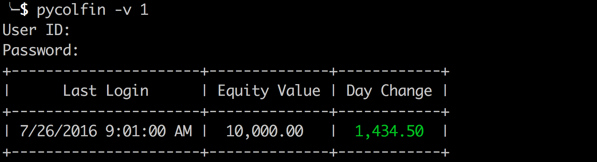
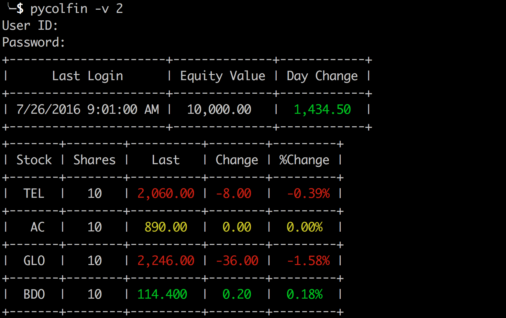
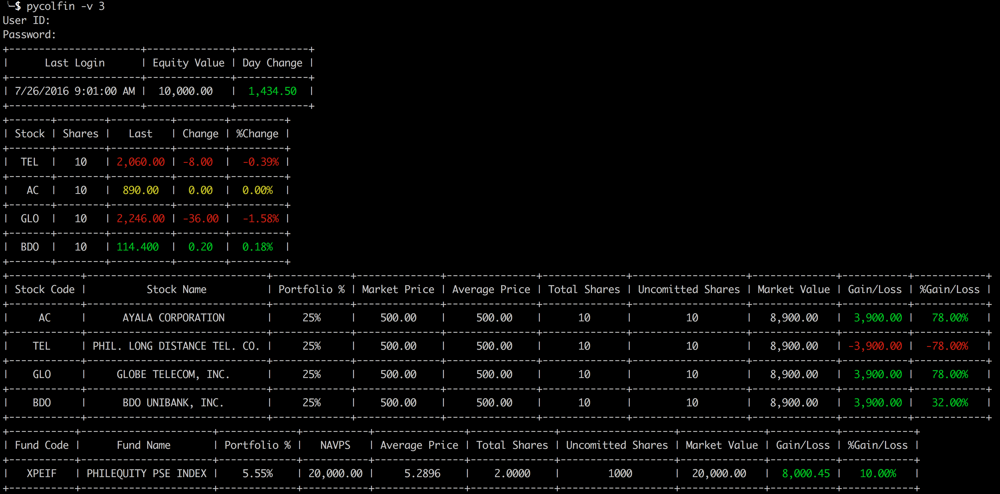

# pycolfin

[](https://pypi.python.org/pypi/pycolfin)

View your investments' performance at http://www.colfinancial.com via terminal


* Free software: MIT license

## Installation
```
# Only works for Python3.x
pip install pycolfin
```

## Usage
```
Usage: pycolfin [OPTIONS]

Options:
  --use-env-vars                 Use USER_ID and PASSWORD from environment
                                 variables
  -v, --verbosity INTEGER RANGE  1 = User ID, Last Login, Equity Value, Day
                                 Change
                                 2 = Display all info from 1 and
                                 portfolio summary
                                 3 = Display all info in 1 &
                                 2 and detailed portfolio
  --help                         Show this message and exit.
```

* Verbosity = 1

* Verbosity = 2

* Verbosity = 3


## Features

* See Issues page: https://github.com/patpatpatpatpat/pycolfin/issues

## Credits

This package was created with [Cookiecutter](https://github.com/audreyr/cookiecutter) and the [audreyr/cookiecutter-pypackage](https://github.com/audreyr/cookiecutter-pypackage) project template.
